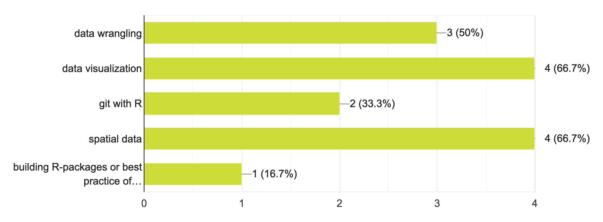
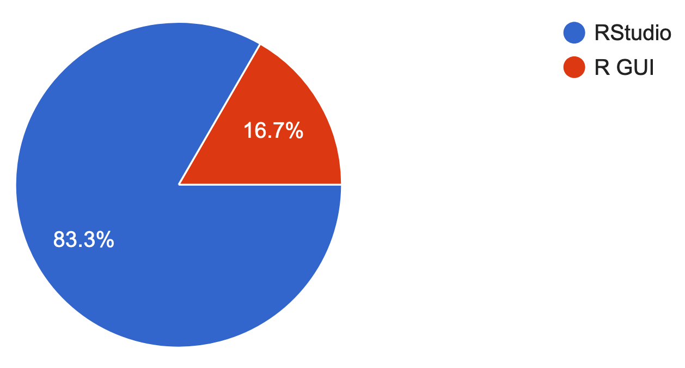
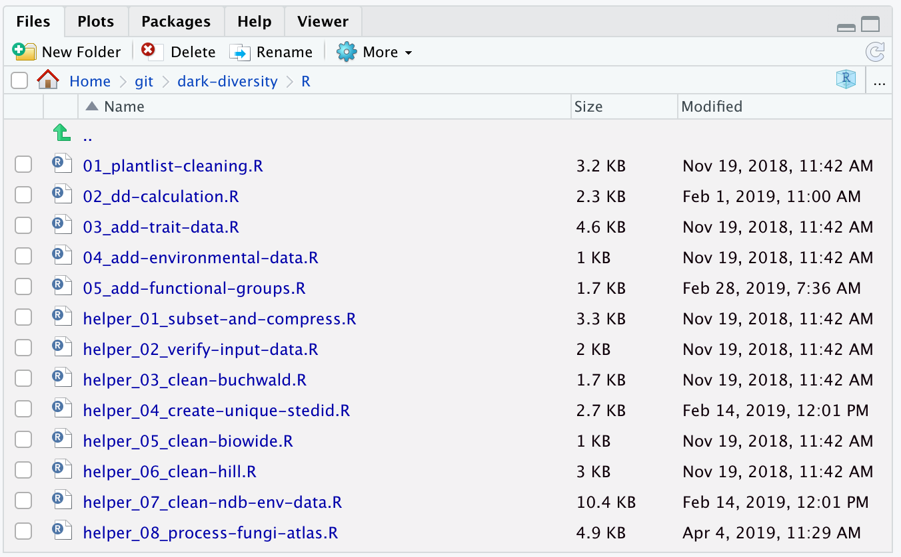

```{r setup, include=FALSE}
options(htmltools.dir.version = FALSE,
        fig.retina = 3,
        warning = FALSE,
        message = FALSE)
```

```{r include=FALSE}
library(tidyverse)
library(lubridate)
library(here)
library(fontawesome)
```


# Program


You asked for:

```{r echo = FALSE}

```

---
# Program


...but first:

- Useful features of the RStudio IDE

- Advice on Project management<sup>1</sup>


.footnote[
[1] My slides here are a boildown of Jenny Bryan's excellent [material](https://github.com/jennybc/what-they-forgot) on Project management
]


---

# RStudio IDE
.pull-left[
Nearly all of you use RStudio (and I strongly recommed using it)

Let's have a look around - live demo

]

.pull-right[
Your answers:

```{r echo = FALSE}

```
]

???

  1. Pane arrangement
  2. Themes
  3. Snippets (ts, lib, fun)
  4. Addins (datapasta)
  5. Keyboard shortcuts 
  6. Cheatsheets


---
layout: true


---

# Use a project-oriented workflow

.footnote[
[1] See Jenny Bryan's [article](https://www.tidyverse.org/articles/2017/12/workflow-vs-script/) on Project-oriented workflows for more details
]
--

Why?

--

Makes these things easier:

- Working on multiple projects at the same time
- Starting and stopping
- Collaborating

--

How?

--

- Have a directory dedicated to your project
- Create an RStudio project
- (make this a `r fa("git-square")` [repo](https://happygitwithr.com/new-github-first.html#make-a-repo-on-github-1))
- Use the [here](https://cran.r-project.org/web/packages/here/index.html) `r emo::ji("package")`


---

# What are the benefits of `.rproj`?

--

- RStudio rembers settings, open files, unsaved files(!), etc.
- Dedicated instance of RStudio (`cmd+tab` to switch between projects)
- Dedicated `R` process
- File browser is looking the right place


--

Demo

---
# The here `r emo::ji("package")`

It knows where your project lives so you don't have to worry about it.

This will work:

```{r eval=FALSE, tidy=FALSE}
source(here("r", "02_plot-maps.R"))
```

even though the absolute path is:
```{r echo=FALSE, tidy=FALSE}
fs::path_wd("r", "02_plot-maps.R")
```

This means it works across different machines (nice when collaborating!)

--

You can now safely remove this line:

```{r eval=FALSE, tidy=FALSE}
setwd("/Users/Lars/path/to/secret/place")
```

---

background-image: url(rstudio-preferences.png)
background-position: 50% 65%
background-size: 40%

# Start with a clean sheet:

---

# Start with a clean sheet:
Restart `R` often! (short-cut `cmd+shift+F10`)

--

This only emties your environment:
```{r eval=FALSE, tidy=FALSE}
rm(list = ls())
```


---

# Names

Make sure to name your stuff properly (your future self will thank you!)

--

Files should be:

1. Machine readable
2. Human readable
3. Sort nicely

--

This implies:

1. no spaces, no punctuation, no funny characters (æ,ø,å!!!!), case matters
2. info on content (2017-06-15_soil-samples.tsv)
3. start with something numeric, left pad with zeros for constant width, dates in ISO 8601

--

Consistent naming of columns will also save you loads of time. The `janitor` `r emo::ji("package")` is a great help

---

# Names

```{r echo = FALSE, out.width='75%', fig.align='center'}

```

---

# Names
.pull-left[
```{r names}
fs::dir_tree(here("data"))

```

]
--
.pull-right[

```{r names-subset}
fs::dir_ls(here("data")) %>% 
  str_subset("soil_data") %>% 
  fs::path_file()
```
]

---
class: middle, center, inverse
# Now to the hands-on part!

---
# The `magrittr` `r emo::ji("package")` 

### 

---
# The `magrittr` `r emo::ji("package")` 


```{r non-pipe-example, eval = TRUE}
factor(as.Date(ymd("2018-06-01"):ymd("2018-06-03"),origin = "1970-01-01"), ordered = TRUE)
```


```{r pipe-example, eval = TRUE}
ymd("2018-06-01"):ymd("2018-06-03") %>% 
  as.Date(origin = "1970-01-01") %>% 
  factor(ordered = TRUE)
```


---
class: middle


# `r emo::ji("package")` that will make life easier:

--

### &nbsp; &nbsp; &nbsp; &nbsp; &nbsp; 


---

# Links
## Some pointers to topics that we didn't cover today:

1. Calling `python` from `R` - [reticulate](http://blog.rstudio.com/2018/03/26/reticulate-r-interface-to-python/)
2. GBIF - see the ropensci `rgbif` [tutorial](https://ropensci.org/tutorials/rgbif_tutorial/)
3. Asking for help - [reprex](https://reprex.tidyverse.org/)

## Suggested reading:
1. Data organization in spreadsheets. [Broman & Woo 2017](https://www.tandfonline.com/doi/abs/10.1080/00031305.2017.1375989) 
2. R for Data Science. [Grolemund & Wickham](https://r4ds.had.co.nz/)


