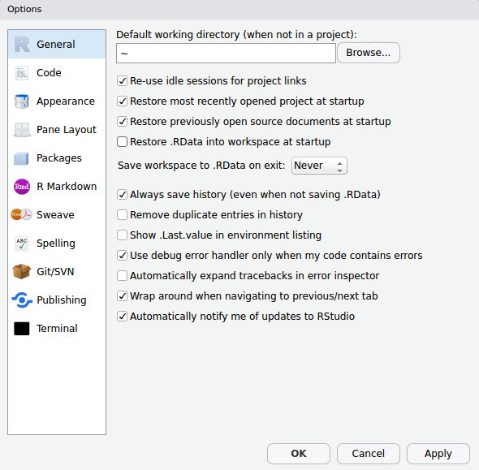

```{r setup, include=FALSE}
options(htmltools.dir.version = FALSE,
        fig.retina = 3,
        warning = FALSE,
        message = FALSE)
```

# Program

Not much time, but here are the topics I think we should touch upon:

--

- Useful features of the RStudio IDE

- Advice on Project management<sup>1</sup>

- The Tidyverse

- Maps

- Importing excel data

- Random stuff that come up over the next couple of hours 


.footnote[
[1] My slides here are a boildown of Jenny Bryan's excellent [material](https://github.com/jennybc/what-they-forgot) on Project management
]
---


# RStudio IDE

Nearly everybody uses RStudio (and I strongly recommed using it)

Let's have a look around - live demo

???

  1. Pane arrangement
  2. Themes
  3. Snippets (ts, lib, fun)
  4. Addins (datapasta)
  5. Keyboard shortcuts 
  6. Cheatsheets


---

# Use a project-oriented workflow<sup>1</sup>

.footnote[
[1] See Jenny Bryan's [article](https://www.tidyverse.org/articles/2017/12/workflow-vs-script/) on Project-oriented workflows for more details
]
--

Why?

--

Makes these things easier:

- Working on multiple projects at the same time
- Starting and stopping
- Collaborating

--

How?

--

- Have a directory dedicated to your project
- Create an RStudio project
- (make this a git repo)
- Use the [here](https://cran.r-project.org/web/packages/here/index.html) `r emo::ji("package")`

---
# The here `r emo::ji("package")`

It knows where your project lives so you don't have to worry about the path that comes before it.

This will work:

```{r eval=FALSE, tidy=FALSE}
source(here("r", "02_plot-maps.R"))
```

even though the real path is:
```{r eval=TRUE, tidy=FALSE}
fs::path_wd("r", "02_plot-maps.R")
```


This means it works across different machines (nice when collaborating!)

---

# What are the benefits of `.rproj`?

--

- RStudio rembers settings, open files, unsaved files(!), etc
- Dedicated instance of RStudio
- Dedicated `R` process
- File browser is looking the right place
- Work directory starts at the right place


-- 

Demo

--

You can now safely remove this line:

```{r eval=FALSE, tidy=FALSE}
setwd("/Users/Lars/path/to/secret/place")
```

---
class: middle, center
# Start with a clean sheet
```{r, out.width = "400px", echo=FALSE}

```

---

# Start with a clean sheet
Restart `R` often! (short-cut `ctrl+shift+F10`)

--

This does not give you a clean start:
```{r eval=FALSE, tidy=FALSE}
rm(list = ls())
```

---

# Names

Make sure to name your stuff properly (your future self will thank you!)

--

1. Machine readable
2. Human readable
3. Sort nicely

--

This implies:

1. no spaces, no punctuation, no funny characters (æ,ø,å!!!!), case matters
2. info on content (2017-06-15_soil-samples.tsv)
3. start with something numeric, left pad with zeros for constant width, dates in ISO 8601


---
background-image: url(tidyverse.png)
background-position: 50% 50%
background-size: 800px
class: center, bottom, inverse

---

background-image: url(sf.png)
background-position: 50% 50%
class: center, bottom, inverse

---

background-image: url(readxl.png)
background-position: 50% 50%
class: center, bottom, inverse

---

background-image: url(xlsx-csv-txt-dilemma.png)
background-position: 50% 50%
background-size: 800px
class: center, bottom, inverse


---

# Links
## Some pointers to topics that we didn't cover today:

1. Calling `python` from `R` - [reticulate](http://blog.rstudio.com/2018/03/26/reticulate-r-interface-to-python/)
2. GBIF - see the ropensci `rgbif` [tutorial](https://ropensci.org/tutorials/rgbif_tutorial/)

## Suggested reading:
1. Data organization in spreadsheets. [Broman & Woo 2017](https://www.tandfonline.com/doi/abs/10.1080/00031305.2017.1375989) 


